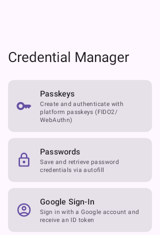
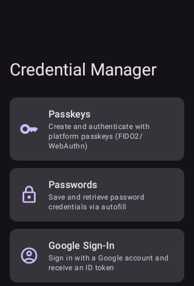

# androidx.credentials Demo

<p align="center">
  
  
</p>

An interactive Android playground for exploring the [Credential Manager API](https://developer.android.com/identity/sign-in/credential-manager) (`androidx.credentials`). Run it on a device or emulator to see each credential flow in action.

---

## Requirements

| Property | Value |
|---|---|
| `minSdk` | **28** (Android 9.0) |
| `targetSdk` / `compileSdk` | 36 |
| Kotlin | 2.0.21 |
| AGP | 9.0.1 |
| Passkeys (native, no Play Services) | API 35+ |
| Passkeys (via Play Services FIDO2 bridge) | API 28-34, requires Google Play Services |

The `credentials-play-services-auth` artifact is included so passkey flows work on API 28+
via the Play Services FIDO2 backend on devices that have it.

---

## Screens

### Home
Navigation hub. Four cards: Passkeys, Passwords, Google Sign-In, About.

### Passkeys
Demonstrates `CreatePublicKeyCredentialRequest` (registration) and `GetPublicKeyCredentialOption`
(authentication). Shows the raw WebAuthn JSON for both the request and the response.

**Demo mode caveat:** The challenge JSON is hardcoded in `MockPasskeyData`. Registration will
proceed through the system UI but will fail with `CreatePublicKeyCredentialDomException` unless
Digital Asset Links are configured (see below). Authentication requires a passkey already
registered for the RP ID.

### Passwords
Demonstrates `CreatePasswordRequest` (save) and `GetPasswordOption` (retrieve). The system
delegates to the active autofill provider (e.g., Google Password Manager).

**Caveat:** On emulators without a configured autofill provider, `getSavedPassword()` throws
`NoCredentialException`. This is expected and shown as a user-friendly message.

### Google Sign-In
Demonstrates `GetGoogleIdOption` + `GoogleIdTokenCredential`. Requires a real Google Cloud
OAuth 2.0 Web client ID (see setup below). The placeholder string triggers a warning banner.

### About
In-app reference: what Digital Asset Links are, how challenges work, SDK requirements,
and setup instructions for each credential type.

---

## What works end-to-end vs. demo-only

| Feature | Requires extra setup | Works out of the box |
|---|---|---|
| Passkey registration | Digital Asset Links on RP domain | UI flow only (DomException expected) |
| Passkey authentication | Registered passkey + DAL | Credential picker shown |
| Password save | Autofill provider (built-in on most devices) | Yes |
| Password retrieve | Saved credential in provider | Yes (or NoCredentialException) |
| Google Sign-In | Real OAuth Web client ID | Warning shown, flow blocked |
| Sign-out (`clearCredentialState`) | None | Yes |

---

## Setup

### Enabling Google Sign-In

1. Open the [Google Cloud Console](https://console.cloud.google.com/) and create or select a project.
2. Go to **APIs & Services > Credentials > Create Credentials > OAuth client ID**.
3. Select **Web application** as the application type.
4. Copy the generated client ID.
5. In `app/build.gradle.kts`, replace the placeholder in both `debug` and `release` `buildConfigField`:

```kotlin
buildConfigField(
    "String",
    "GOOGLE_WEB_CLIENT_ID",
    "\"<your-client-id>.apps.googleusercontent.com\"",
)
```

### Enabling passkeys end-to-end

1. Deploy a file at `https://<your-domain>/.well-known/assetlinks.json`:

```json
[{
  "relation": ["delegate_permission/common.handle_all_urls"],
  "target": {
    "namespace": "android_app",
    "package_name": "info.yuryv.androidx_credentials_demo",
    "sha256_cert_fingerprints": ["<your-app-signing-certificate-sha256>"]
  }
}]
```

2. Retrieve the SHA-256 fingerprint of your signing key:

```
keytool -list -v -keystore ~/.android/debug.keystore -alias androiddebugkey \
        -storepass android -keypass android
```

3. Update `MockPasskeyData.RP_ID` to match your domain.
4. Replace the hardcoded challenge JSON in `MockPasskeyData` with server-generated values
   from your `/auth/register/begin` and `/auth/authenticate/begin` endpoints.

---

## Architecture

```
MainActivity
  └── AppNavigation (NavHost)
        ├── HomeScreen
        ├── PasskeyScreen       ← PasskeyViewModel
        ├── PasswordScreen      ← PasswordViewModel
        ├── GoogleSignInScreen  ← GoogleSignInViewModel
        └── AboutScreen

data/
  CredentialRepository     — suspending wrappers around CredentialManager, returns Result<T>

util/
  MockPasskeyData          — hardcoded WebAuthn JSON for demo flows
  CredentialError.kt       — Throwable.toDisplayMessage() extension

ui/components/
  CredentialCard, ResultDisplay, SectionHeader, InfoBanner
```

No dependency injection framework is used — `CredentialRepository` is constructed once in
`MainActivity` and passed into the nav graph. A production app should use Hilt.

---

## Tests

### Unit tests (no device required)

Run with:
```
./gradlew testDebugUnitTest
```

| Test class | What it covers |
|---|---|
| `MockPasskeyDataTest` | Validates registration and authentication JSON contain required WebAuthn fields, correct RP ID, non-blank challenge, empty `allowCredentials` array |
| `CredentialErrorTest` | Verifies `toDisplayMessage()` maps each known exception class to a non-blank, recognizable string |

### Instrumented tests (device or emulator required)

Run with:
```
./gradlew connectedDebugAndroidTest
```

| Test class | What it covers |
|---|---|
| `ExampleInstrumentedTest` | Package name sanity check |
| `NavigationTest` | Home screen shows all cards; each card navigates to its screen; back returns to Home |

**What cannot be tested programmatically:**

- Passkey creation/authentication — requires system UI interaction and OS-level biometric
  prompt that cannot be driven by Compose test rules or Espresso.
- Password save prompt — triggers an autofill system dialog outside the app's UI hierarchy.
- Google Sign-In bottom sheet — a Google Play Services dialog, outside Compose tree.

These flows must be verified manually on a device.

---

## CI

GitHub Actions runs on every push and pull request to `main`:

| Job | Trigger | Artifact |
|---|---|---|
| `lint` | always | `lint-report/*.html` |
| `unit-test` | always | `unit-test-results/` |
| `build` | after lint + unit-test pass | `app-debug.apk` (7-day retention) |

Dependabot is configured to open weekly PRs for Gradle and GitHub Actions dependency updates.

---

## Key values at a glance

| Constant | Value |
|---|---|
| `MockPasskeyData.RP_ID` | `credentialsdemo.yuryv.info` |
| Demo challenge (base64url) | `Uf68Xn4eLLA3V8tROCKgmgTkqpXIWZLM2nzFpMdJK0I` |
| `BuildConfig.GOOGLE_WEB_CLIENT_ID` | placeholder (replace before testing Sign-In) |
| credentials library version | `1.5.0` |
| googleid library version | `1.1.1` |
